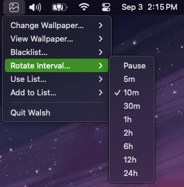

# walsh


Walsh is a wallpaper manager for randomizing images on multiple displays from
various configured sources. It supports saving images to lists, blacklisting
unwanted images, downloading images, and more. It's a wrapper around existing
desktop tools for to add extra features that I wanted.

🚧 **This project is a continuous work in progress.** 🚧

This is a hacky hobby project that's evolved from shell scripts that I iterated
on over the years There's unlikely a large audience for this tool. It will
remain as a `0.x` version indefinitely. Refer to the
[CHANGELOG](./CHANGELOG.md) for updates.

## ⭐ Features

* CLI, system tray, and fuzzy menu wallpaper manager for quick access to actions
* Set wallpapers randomly or specifically for each display
* Change wallpapers on demand or at regular intervals
* Manage wallpaper lists and set wallpapers from these lists
* Track recent wallpapers to avoid repetition, avoid same wallpaper on
  multiple displays
* Source images from a remote server over SSH
* Download wallpapers from Bing and Unsplash using [gosimac](https://github.com/1995parham/gosimac)
* Blacklist unwanted wallpapers (helpful when downloading in bulk)
* Supports Xorg, Wayland, and macOS



## 🚀 Getting Started

### Quick Start

1. Download and install:

    ```shell
    curl -sfL https://raw.githubusercontent.com/joshbeard/walsh/master/install.sh | sh -
    ```

2. Run:

    ```shell
    walsh
    ```

### Summary

1. Ensure [dependencies](#-dependencies) are installed.
2. [Install](#-installation) the latest version of walsh.
3. [Run](#-usage) walsh to set a random wallpaper on each display.
    * You can run `walsh download bing` to get a few wallpapers to start.
    * Then just run `walsh set` to set a random wallpaper.
    * `~/Pictures/Wallpapers` is the default source directory.
4. [Configure](#-configuration) walsh to customize it, specifically the sources
   you want to use.

## 📋 Dependencies

### Wayland

Only [swww](https://github.com/Horus645/swww) is supported for setting the
wallpaper on Wayland. swww works across Wayland compositors. A custom command
can be specified in the configuration file to use another tool.

Hyprland and Sway have been tested and are known to work, using `hyprctl` and
`swaymsg` respectively.

### Xorg

* `xrandr`
* One of the following tools, in order of preference, or set a custom command:
  * [nitrogen](https://wiki.archlinux.org/title/Nitrogen)
  * [feh](https://wiki.archlinux.org/title/Feh)
  * [xwallpaper](https://github.com/stoeckmann/xwallpaper)
  * [xsetbg](https://linux.die.net/man/1/xsetbg)

### macOS

No external dependencies are required for macOS.

### Download from Bing and Unsplash

If the `download` command is used, the [gosimac](https://github.com/1995parham/gosimac)
tool should be installed and in the `PATH`.

## 📦 Installation

The latest release can be found on the [releases](https://github.com/joshbeard/walsh/releases)
page and can be downloaded and installed manually.

To download and install the latest version of walsh using `curl` and piping it
to the shell, run the following command:

```sh
curl -sfL https://raw.githubusercontent.com/joshbeard/walsh/master/install.sh | sh -
```

<details>

<summary>What the installation script does</summary>

- Detects your OS and architecture.
- Downloads the latest release of walsh from GitHub.
- Verifies the checksum of the downloaded package.
- Extracts the binary and moves it to the specified directory (default is `$HOME/bin`).

</details>

Make sure the installation directory is in your `PATH` so you can easily run
`walsh` from anywhere.

### Custom Installation Directory

If you want to specify a custom installation directory, you can set the
`INSTALL_DIR` environment variable or pass the `-d` (or `--dir`) argument. For
example:

```sh
# Using INSTALL_DIR environment variable
INSTALL_DIR=/usr/local/bin curl -sfL https://raw.githubusercontent.com/joshbeard/walsh/master/install.sh | sh -

# Using -d (or --dir) argument
curl -sfL https://raw.githubusercontent.com/joshbeard/walsh/master/install.sh | sh -s -- -d /usr/local/bin
```

### Install from Source

To install from source, clone the repository and run `go build`:

```sh
git clone https://github.com/joshbeard/walsh.git
cd walsh
go build -o walsh .
mv walsh ~/bin
```

## ⚙️ Usage

```shell
walsh [command] [flags]
```

See `walsh help` for more information.

If you run `walsh` without any arguments, it defaults to the `set` command and
will set a random wallpaper on each display.

Ensure a configuration file exists at the default location and has at least one
source configured. See [Configuration](#-configuration) for more information.

### Set Wallpaper

```shell
# Set a random wallpaper on each display using the configured sources:
walsh set

# Set a random wallpaper on a specific display:
walsh set -d 1
walsh s 1
walsh s eDP-1

# Set a random wallpaper from a list:
walsh set -l my-list

# Set a random wallpaper from a directory:
walsh set ~/Pictures/wallpapers

# Set a specific wallpaper on each display:
walsh set ~/Pictures/wallpapers/wallpaper.jpg

# Set a specific wallpaper on a specific display:
walsh set -d 1 ~/Pictures/wallpapers/wallpaper.jpg

# Set a random wallpaper from an SSH source:
walsh set ssh://user@host/path/to/wallpapers
```

### View Wallpaper

```shell
# View the current wallpaper on each display:
walsh view

# View the current wallpaper on a specific display:
walsh view -d 1
```

### Blacklist

```shell
# Blacklist the current wallpaper on a specific display:
walsh bl -d 1

walsh bl 1
```

### Download

Download wallpapers from Bing and Unsplash using
[gosimac](https://github.com/1995parham/gosimac).

```shell
walsh download bing
walsh download unsplash

# Use short aliases:
walsh dl b
walsh dl u

# Use a query with Unsplash:
walsh dl u -- --query "nature"
```

## 🔧 Configuration

Standard XDG configuration directories are used for configuration files.

The default configuration file is `${XDG_CONFIG_HOME}/walsh/config.yml`
(e.g. `~/.config/walsh/config.yaml`) and will be created if it does not exist.

See [`config.yml`](config.yml) for the default configuration file.

### Sources

Sources is a list of directories or URIs to source images from. Directories
are absolute or relative paths to directories on the local filesystem and can
use environment variables (e.g. `${HOME}/Pictures/Wallpapers`).
Alternatively, an SSH URI can be used to source images from a remote directory.

```yaml
sources:
  - /home/user/Pictures/wallpapers
  - ssh://user@host:/path/to/wallpapers
  - ssh://myhost:/path/to/wallpapers
```

When using SSH, the environment should have SSH keys configured and an agent
running. The `SSH_AUTH_SOCK` environment variable should be set.

### Desktop Environment Integration

* To run walsh in the background with a system tray icon, use `walsh run`.
* To run walsh in the CLI on-demand, use `walsh set`.

Run `walsh` however you like to set wallpapers. On Linux/BSD desktops, it's
preferred to use the startup configuration of your desktop environment to run
`walsh` at login. You can also use something like cron, systemd, or a launchd
agent to run `walsh` at regular intervals. Or just run it on demand.

#### Fuzzy Finders: rofi/wofi/dmenu/choose

Walsh's `menu` command can be used to launch a menu in Rofi, Wofi, or Dmenu to
perform quick actions.

```shell
walsh menu
```

The menu command can be customized in the configuration file:

```yaml
dmenu_command: "rofi -dmenu -i -p walsh -lines 10 -theme /path/to/theme.rasi"
```

A tool similar to rofi for macOS is [choose](https://github.com/chipsenkbeil/choose).

#### Hyprland

<details>

<summary>Using `hyprctl`</summary>

In `~/.config/hypr/hyprland.conf`:

```plain
exec-once = $HOME/bin/walsh run
```

When an SSH source is used, you may need to set the `SSH_AUTH_SOCK` environment
variable:

```plain
exec-once = SSH_AUTH_SOCK=/run/user/1000/gcr/ssh $HOME/bin/walsh run
```

</details>

#### i3

<details>

<summary>Using `i3`</summary>

In `~/.config/i3/config`:

```plain
exec --no-startup-id $HOME/bin/walsh run
```

When an SSH source is used, you may need to set the `SSH_AUTH_SOCK` environment
variable:

```plain
exec --no-startup-id export SSH_AUTH_SOCK=/run/user/1000/gcr/ssh && $HOME/bin/walsh
```

</details>

#### macOS launchd

<details>

<summary>Using `launchd`</summary>

Create a `launchd` plist file at
`~/Library/LaunchAgents/com.github.joshbeard.walsh.plist` with the following
contents:

```xml
<?xml version="1.0" encoding="UTF-8"?>
<!DOCTYPE plist PUBLIC "-//Apple//DTD PLIST 1.0//EN" "http://www.apple.com/DTDs/PropertyList-1.0.dtd">
<plist version="1.0">
<dict>
    <key>Label</key>
    <string>com.yourusername.walsh</string>
    <key>ProgramArguments</key>
    <array>
        <string>/Users/yourusername/bin/walsh</string>
        <string>run</string>
    </array>
    <key>RunAtLoad</key>
    <true/>
    <key>StandardOutPath</key>
    <string>/tmp/walsh.stdout</string>
    <key>StandardErrorPath</key>
    <string>/tmp/walsh.stderr</string>
</dict>
</plist>
```

Then load the plist:

```shell
launchctl load ~/Library/LaunchAgents/com.github.joshbeard.walsh.plist
```

To unload the plist:

```shell
launchctl unload ~/Library/LaunchAgents/com.github.joshbeard.walsh.plist
```

</details>

## Supported Platforms

| Desktop Environment | CLI              | System Tray        | Fuzzy Finder |
| ------------------- | ---------------- | ------------------ | ------------ |
| Hyprland            | Full functional  | Tested with Waybar | Tested with rofi, wofi
| Sway                | Full functional  | Tested with Waybar | Tested with rofi, wofi
| i3                  | Full functional  | doesn't work with i3bar; others unknown | Tested with rofi, dmenu
| Other Xorg WMs      | unknown          | unknown            | rofi, dmenu
| macOS               | Fully functional | Fully functional   | Tested with choose

## Limitations and Known Issues

* **GNOME/KDE:** GNOME and KDE are not currently supported. It might work, but
  probably not.
* **System Tray:** The system tray does not work in some environments, particularly
  on XOrg environments that don't use a dbus-based system tray.
  [fyne-io/fyne/discussions/4383](https://github.com/fyne-io/fyne/discussions/4383)
  relates to this.
* **macOS:** Each virtual desktop has its own wallpaper, which isn't currently
  supported by walsh. The wallpaper will only be set on the active desktops.
  When using the _blacklist_ and _view_ features, the current wallpaper of the
  active desktop is used. When adding a wallpaper to another list, the
  wallpaper set on the original desktop is used (because the original source is
  needed).

## 📜 License

walsh is released under the [0BSD license](./LICENSE.md)

## 👏 Acknowledgements

Icon made by logisstudio from [Flaticon](https://www.flaticon.com/free-icons/gallery).

Walsh relies on these tools:

* [swww](https://github.com/LGFae/swww)
* [nitrogen](https://wiki.archlinux.org/title/Nitrogen)
* [gosimac](https://github.com/1995parham/gosimac)
* [feh](https://wiki.archlinux.org/title/Feh)
* [xwallpaper](https://github.com/stoeckmann/xwallpaper)

Most of Walsh's functionality is developed using these libraries:

* [spf13/cobra](https://github.com/spf13/cobra)
* [fyne-io/systray](https://github.com/fyne-io/systray)
